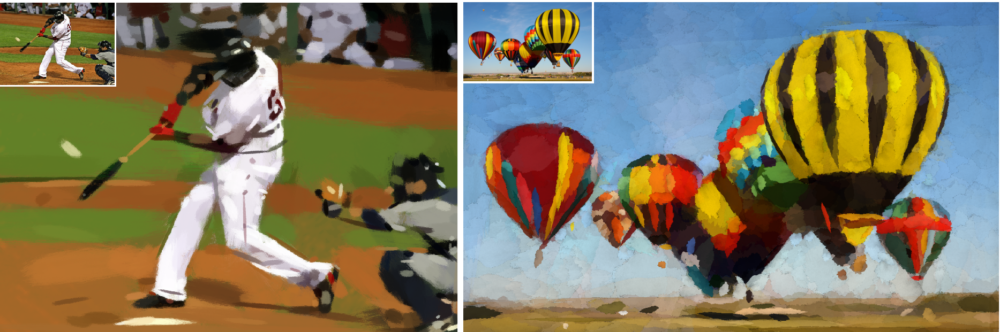

# Image Painter: An Optimized Stroke-Based Algorithm for Artistic Image Stylization
**Chang-Chieh Cheng**\
Information Technology Service Center, National Yang Ming Chiao Tung University, Hsinchu, Taiwan\
Email: jameschengcs@nycu.edu.tw

## Abstract
Image Painter (IP) is a novel stroke-based rendering (SBR) algorithm that converts input photographs into painting-style images using a sequence of brush strokes. 
Leveraging techniques from non-photorealistic rendering, IP supports both stylization and abstraction, even when limited to a small number of strokes. 
While traditional SBR methods often struggle to maintain quality under such constraints, IP addresses this challenge through accurate stroke initialization using connected-component labeling and principal component analysis. 
Rendering quality is further enhanced via a multi-stage trial-and-error optimization process, including forward and backward refinements. 
Experimental results show that IP achieves high-quality visual results with substantially fewer strokes, outperforming existing methods across key metrics: Mean Squared Error (MSE), Structural Similarity Index (SSIM), Peak Signal-to-Noise Ratio (PSNR), and Learned Perceptual Image Patch Similarity (LPIPS). 
These results highlight IP’s effectiveness and potential for applications in digital art, entertainment, and creative image editing.


<p align="center"> </p>

*Two variant painting styles simulated by the proposed method. The left and right images present oil sketch and watercolor styles, respectively, with each rendering utilizing 500 strokes. The input image souced from ImageNet is depicted in the top-left corner of each frame.*

### Hardware requirements
+ CUDA 11.8 compatible GPU
### Software requirements
* [connected-components-3d 3.14.1](https://pypi.org/project/connected-components-3d/)
* OpenCV 4.9
* pillow 10.3.0
* PyTorch 2.2
* scikit-learn 1.4.2
* scikit-image 0.22.0
### Usage
```
python ip.py input_path output_path
              [--a=int] [--b=str] [--m=int] [--f=n] [--s=int] 
              [--tau_y=int] [--tau_x=int] 
              [--beta=float] [--bo=int]
              [-o] [-j]
```
#### Parameters
* *input_path*: Input filepath. The input can be an image or json file.
* *output_path*: Output filepath, *.png or *.mp4.
* *--a*: Accuracy, 0 and 7 indicate the lowest and highest accuracies respectively. The default value is 4.
* *--b*: Brush name. The default value is *watercolor1*. Ensure that all brush templates are in PNG format and are stored within the *brush* directory. The filenames, excluding extensions, serve as the brush names.
* *--m*: Maximum number of strokes. The default value is 500.
* *--f*: Frame per second (FPS). The default value is 8. 
* *--tau_x*: Width of the sub-region. By default, it is automatically determined based on m and the image width.
* *--tau_y*, Height of the sub-region. By default, it is automatically determined based on m and the image height.
* *--beta*: Difference threshold. The default value is 0.3.
* *--bo*: Number of rounds of backward optimization. By default, it is automatically determined based --a.
* *-o*: Using brush template as oppacity.
* *-j*: Output json file.
  
#### Examples
```
python ip.py testdata/flower.jpeg output/flower_1.png --m=500 --b=watercolor1
python ip.py testdata/flower.jpeg output/flower_2.png --m=250 --b=chalk -o -j
python ip.py output/flower_2.json output/flower_3.mp4 --b=chalk -o --s=1 --f=20
```

#### For comparative analysis with other SBR methods:
$m=$ 50, 100, 150, 500, and 200
```
python ip.py input_path output_path --m=50 --b=CNP
python ip.py input_path output_path --m=100 --b=CNP
python ip.py input_path output_path --m=250 --b=CNP 
python ip.py input_path output_path --m=500 --b=CNP
python ip.py input_path output_path --m=2000 --b=CNP 
```
*The test dataset consisted of CelebA and the validation folder of ImageNet.* <br />
[CelebA](https://mmlab.ie.cuhk.edu.hk/projects/CelebA.html) <br />
[ImageNet](https://www.image-net.org/) <br />

#### json format
```
{
"shape": [height, width, channels],
"bg": [r, g, b],
"Q": [q1, q2, ..., qn] and each q = [x-coordinate, y-coodinate, width, height, orientation, opaccity, r, g, b].
}
```

#### Demo
[](https://youtu.be/tsGGtY4C4Tk) [](https://youtu.be/aN9p5iSKGAg)
 
## Citation
If you use this code please cite it as:
```
@ARTICLE{10.1109/MMUL.2025.3646865,
author={Cheng, Chang-Chieh},
journal={ IEEE MultiMedia },
title={{ Image Painter: An Optimized Stroke-Based Algorithm for Artistic Image Stylization }},
year={5555},
volume={},
number={01},
ISSN={1941-0166},
pages={1-14},
doi={10.1109/MMUL.2025.3646865},
url = {https://doi.ieeecomputersociety.org/10.1109/MMUL.2025.3646865},
publisher={IEEE Computer Society},
address={Los Alamitos, CA, USA},
month=dec
}
```
